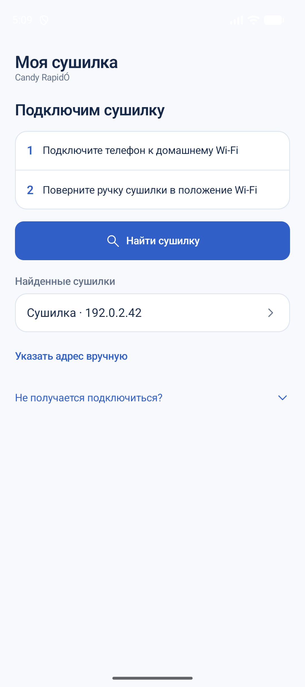
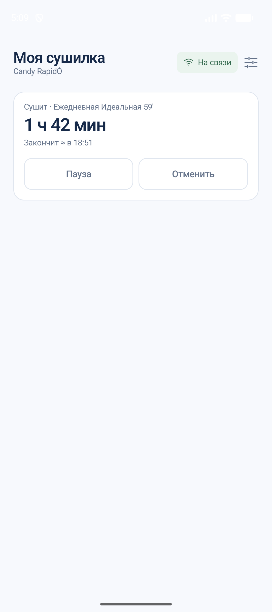
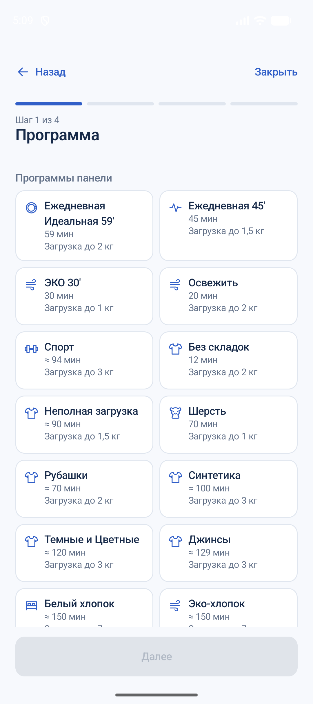
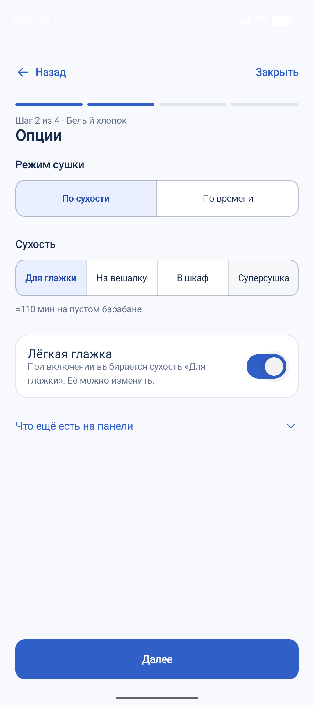
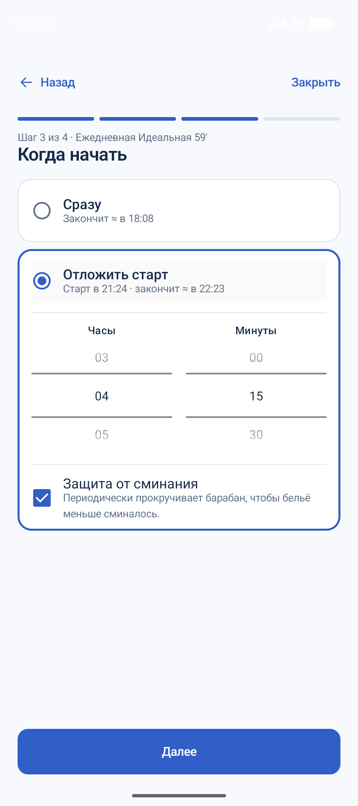
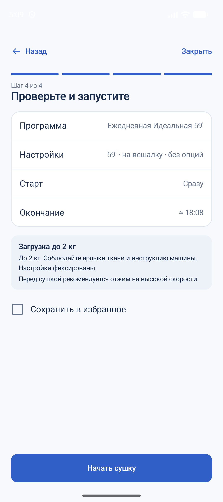

# CandyCMD

[English](README.md) · Русский

Неофициальное Android-приложение для управления сушильной машиной **Candy RapidÓ RO4 H7A1TCEX-07** с телефона через домашнюю Wi-Fi-сеть.

## Зачем это приложение

Официальное приложение Candy simply-Fi перестало работать с этой сушилкой, поэтому CandyCMD создан, чтобы управлять ей напрямую через локальную сеть.

Проект разработан с помощью ИИ-агентов для программирования Claude Code и Codex.

## Возможности

- Состояние сушилки, оставшееся время сушки и приблизительное время окончания.
- Выбор программ панели и дополнительных рецептов сушки.
- Настройка уровня сухости, сушки по таймеру и Лёгкой глажки, если выбранная программа их поддерживает.
- Немедленный запуск или отсрочка до 24 часов.
- Пауза, продолжение и отмена сушки, отмена отложенного запуска.
- Сохранение программ и настроек в избранное для быстрого доступа.
- Светлая, тёмная или системная тема.

## Скриншоты

Интерфейс приложения сейчас на русском языке. На скриншотах показаны демонстрационные состояния сушилки.

<table>
  <tr>
    <th>Подключение сушилки</th>
    <th>Текущая сушка</th>
    <th>Выбор программы</th>
  </tr>
  <tr>
    <td></td>
    <td></td>
    <td></td>
  </tr>
  <tr>
    <th>Настройки сушки</th>
    <th>Отложенный запуск</th>
    <th>Проверка и запуск</th>
  </tr>
  <tr>
    <td></td>
    <td></td>
    <td></td>
  </tr>
</table>

## Начало работы

Нужны телефон с **Android 8.0 или новее** и сушильная машина **Candy RO4 H7A1TCEX-07**, уже подключённая к домашней Wi-Fi-сети. Первичная настройка Wi-Fi описана в инструкции сушилки.

1. Скачайте APK в [Releases](../../releases) или [соберите из исходников](#сборка-из-исходников) и установите на телефон.
2. Подключите телефон к той же Wi-Fi-сети, что и сушилка.
3. Включите сушилку и поверните ручку в положение **Wi-Fi**.
4. Откройте CandyCMD, разрешите доступ к локальной сети, если приложение его запросит, и нажмите **«Найти сушилку»**.
5. Выберите сушилку, программу и настройки, затем проверьте параметры и подтвердите запуск.

Для CandyCMD не нужна учётная запись. Повседневное управление уже подключённой сушилкой работает через домашнюю Wi-Fi-сеть без доступа к интернету.

## Совместимость и ограничения

- Поддерживается конкретная модель **Candy RO4 H7A1TCEX-07**. Совместимость с другими моделями не подтверждена.
- Доступные настройки зависят от программы. У дополнительных рецептов настройки могут быть фиксированными; некоторые функции требуют использования панели сушилки.
- Время автоматической сушки приблизительное: фактическая длительность зависит от загрузки и влажности белья.
- Управление доступно, пока телефон и сушилка находятся в одной локальной сети.

## Сборка из исходников

Требования: JDK 25, Android SDK Platform 37 и Build Tools 36.0.0.

```sh
./gradlew :androidApp:assembleDebug
```

APK появится в `androidApp/build/outputs/apk/debug/`. Список изменений — в [CHANGELOG](CHANGELOG.md).

## Лицензия

CandyCMD распространяется по [лицензии MIT](LICENSE).

CandyCMD — независимый проект, не связанный с Candy или Haier.
